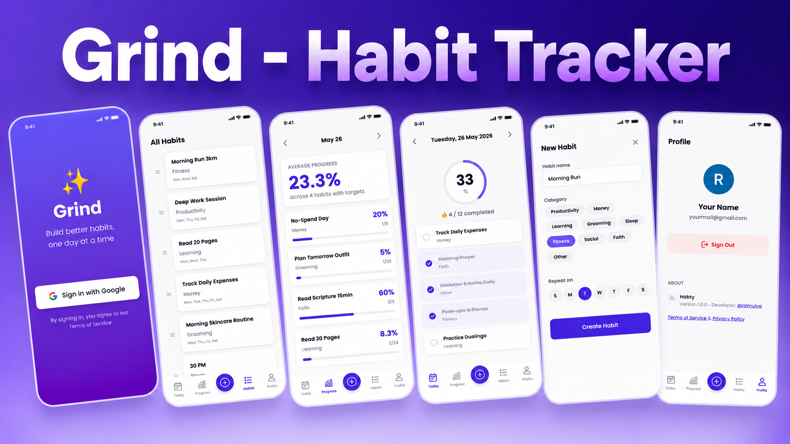
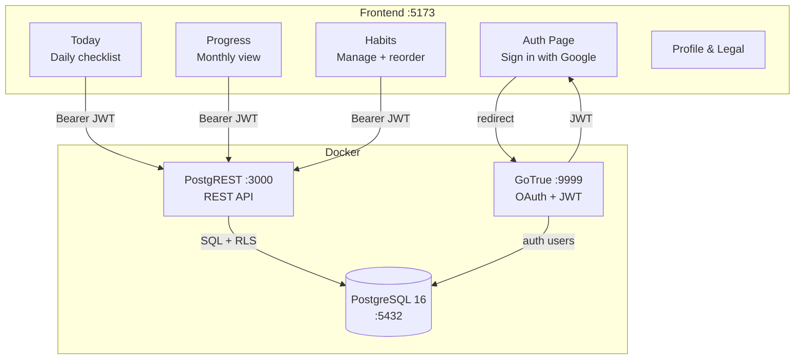
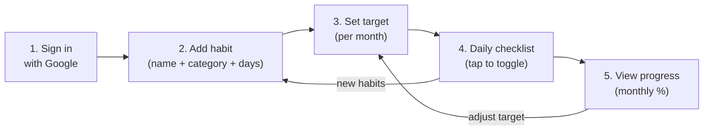

# Grind

Habit tracking app.

Built with React + PostgREST + GoTrue + PostgreSQL.

<p align="center">
  
</p>

---

## Architecture



## User Flow



1. **Sign in** — Google OAuth via GoTrue. `sync_user_from_auth()` trigger copies user to `public.users`. JWT stored by GoTrueClient (auto-refresh, persist session).

2. **Add habit** — `POST /habits` with `name`, `category_id`, `days_of_week[]`. `user_id` auto-filled from JWT. Sortable later via drag & drop.

3. **Set target** — Tap a habit on Progress page → `UPSERT monthly_targets` on conflict `(habit_id, year_month)`. Establishes a baseline for percentage calculation.

4. **Checklist** — Tap a habit on Today page → `habitLogService.toggle()` creates or deletes a `habit_log` row. Idempotent. Progress ring updates via server refetch.

5. **Progress** — `RPC get_monthly_progress()` LEFT JOINs habits → categories → targets → logs. Returns per-habit: `target`, `completed`, `progress_pct`. Average calculated client-side.

## Security

| Layer | Mechanism |
|---|---|
| Auth | Google OAuth only. JWT signed with secret from `.env` |
| Multi-user | RLS on every table via `current_user_id()` from JWT sub |
| Token | GoTrueClient auto-refresh (`persistSession`, `detectSessionInUrl`) |
| Data isolation | `anon` = SELECT only. `authenticated` cannot INSERT `users` (trigger only) |
| Credentials | All secrets via `.env` (DB, JWT, Google OAuth) |

## Quick Start

```bash
cp .env.example .env                 # fill Google OAuth credentials
docker-compose up -d                 # start backend services
cd frontend && npm install && npm run dev
```

Open `http://localhost:5173` → Sign in with Google.

```bash
# optional: seed demo data
./demo.sh
```

---

See [SERVICE.md](./SERVICE.md) for backend services & API reference.  
See [frontend/README.md](./frontend/README.md) for frontend details.
